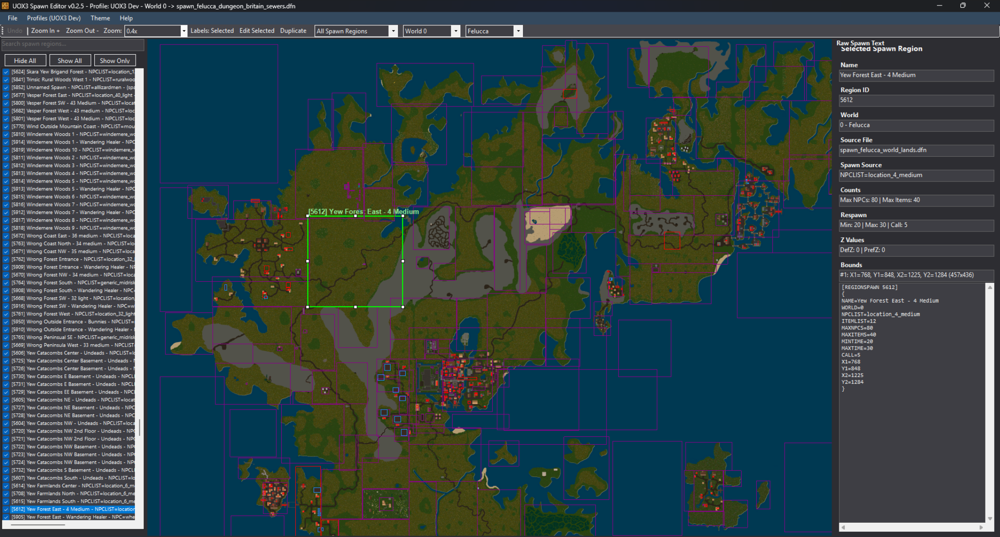

# UOX3 Spawn Editor

A modern, map-based spawn region editor for UOX3 designed to simplify creation, editing, and management of spawn systems across multiple worlds.

Built for shard developers who want fast, visual control over spawn regions without manually editing DFN files.

---

## Preview

---

## Features

### Map-Based Editing

* Visualize spawn regions directly on the map
* Click, drag, and adjust regions with ease
* Real-time feedback when modifying spawn areas

### Multi-World Support

* Supports multiple facets (Trammel, Felucca, Ilshenar, etc.)
* Automatically filters spawn regions based on world
* Handles different map sizes correctly per facet

### Load Entire Spawn Folders

* Load full directories of spawn files at once
* No longer limited to a single spawn file
* Ideal for large shards with organized spawn structures

### Region Management

* Toggle visibility of individual spawn regions
* Bulk enable/disable regions from the side panel
* Organize regions by type (towns, dungeons, etc.)

### Search and Filtering

* Search by region name or metadata
* Quickly locate specific spawn entries
* Designed for large-scale spawn datasets

### DFN Integration

* Works directly with UOX3 DFN spawn files
* Preserves existing structure and formatting
* No need to convert or migrate data

### Performance Improvements

* Optimized loading for large spawn collections
* Faster rendering and interaction compared to manual editing

### Editing Capabilities

* Create new spawn regions
* Modify existing regions
* Delete regions or entire DFN files
* Rename and reorganize entries

### Undo Support

* Undo recent changes during editing

### Quality of Life

* Toggle region labels on/off
* Improved map navigation
* Keyboard shortcuts (Delete key support)
* Dark mode support

---

## Getting Started

1. Launch the tool
2. Load your spawn folder(s)
3. Select the world/facet you want to view
4. Toggle regions or edit directly on the map

---

## Requirements

* UOX3
* DFN spawn files
* Windows (.NET / Visual Studio build)

---

## Community & Support

Discord:
https://discord.com/channels/487859565254148100/1485359141634572338

---

## Contributing

Contributions and feedback are welcome.

* Open an issue
* Submit a pull request
* Share feedback in Discord

---

## License

MIT License
